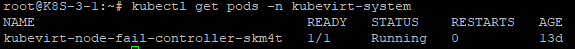

# Failover Controller 설치 가이드

Tmax A&C, CK2-1 Team
> Taesun Lee <taesun_lee@tmax.co.kr>, Haemyung Yang <haemyung_yang@tmax.co.kr>

## 구성 요소 및 버전

* failover-controller docker image
  * 버전: v1.5
  * `최신 버전 정보`는 [tmaxcloudck/kube-failover-controller docker hub](https://hub.docker.com/r/tmaxcloudck/kube-failover-controller/tags) 또는 [CHANGELOG-failover-controller.md](CHANGELOG-failover-controller.md) 파일에서 확인 가능합니다.
* `apps/v1` 를 사용함으로 Kubernetes 버전 `v1.9` 이상을 사용해야합니다..

## 폐쇄망 구축 가이드

1. 폐쇄망에서 설치하는 경우

  *  작업 디렉토리 생성 및 환경 설정
  ```sh
  $ mkdir -p ~/failover-controller
  $ export FAILOVER_VERSION=${failover controller image version}
  $ export DOCKER_REGISTRY=${docker_registry}
  $ export FAILOVER_HOME=~/failover-controller
  $ export VERSION_NAME=main # main 혹은 4.1 등 설치를 위한 version(git branch 명)을 사용
  $ cd $FAILOVER_HOME
  ```

  * 외부 통신이 가능한 환경에서 필요한 이미지 및 yaml 파일을 다운받고 해당 파일을 Master의 $FAILOVER_HOME으로 이동시킨다.
  ```sh
  $ docker pull tmaxcloudck/kube-failover-controller:$FAILOVER_VERSION
  $ docker save tmaxcloudck/kube-failover-controller:$FAILOVER_VERSION > failover-controller.tar
  $ wget https://raw.githubusercontent.com/tmax-cloud/install-kubevirt/${VERSION_NAME}/manifest/yamls/failover-controller.yaml
  ```

  * failover-controller.tar를 docker-registry에 배포 한다.
  ```sh
  $ docker load -i failover-controller.tar 
  $ docker tag tmaxcloudck/kube-failover-controller:${FAILOVER_VERSION} ${DOCKER_REGISTRY}/tmaxcloudck/kube-failover-controller:${FAILOVER_VERSION}
  $ docker push ${DOCKER_REGISTRY}/tmaxcloudck/kube-failover-controller:${FAILOVER_VERSION}
  $ sed -i "s/tmaxcloudck\/kube-failover-controller:%FAILOVER_VERSION%/${DOCKER_REGISTRY}\/tmaxcloudck\/kube-failover-controller:${FAILOVER_VERSION}/g" ${FAILOVER_HOME}/manifest/yamls/failover-controller.yaml
  $ sed -i "s@%HOME%@${HOME}@g" ${FAILOVER_HOME}/manifest/yamls/failover-controller.yaml
  ```
  
## 설치 가이드

### Step 1. Controller 배포:

* k8s cluster 환경에서 failover controller를 배포한다. 

```sh
$ kubectl apply -f failover-controller.yaml
```

### Step 2. Controller 확인:

* k8s cluster의 master node에 controller가 정상적으로 배포되었는지 확인한다.(status Running 확인)

```sh
$ kubectl get pods -n kubevirt-system
```



## 삭제 가이드

* 다음의 명령을 실행하여 failover controller를 삭제한다.

```sh
kubectl delete -f manifests/failover-controller.yaml
```
